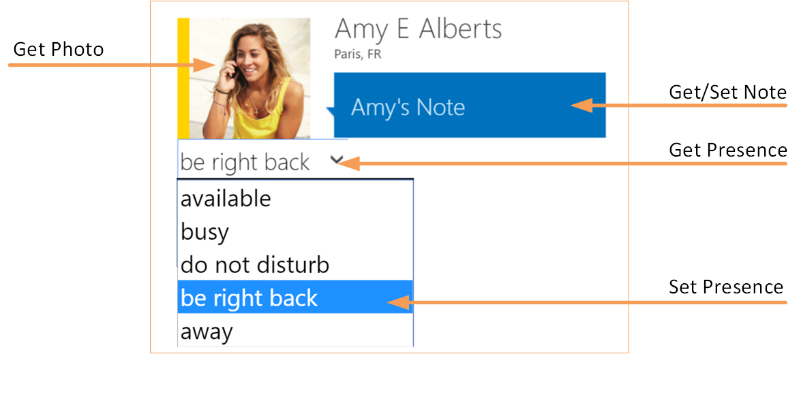
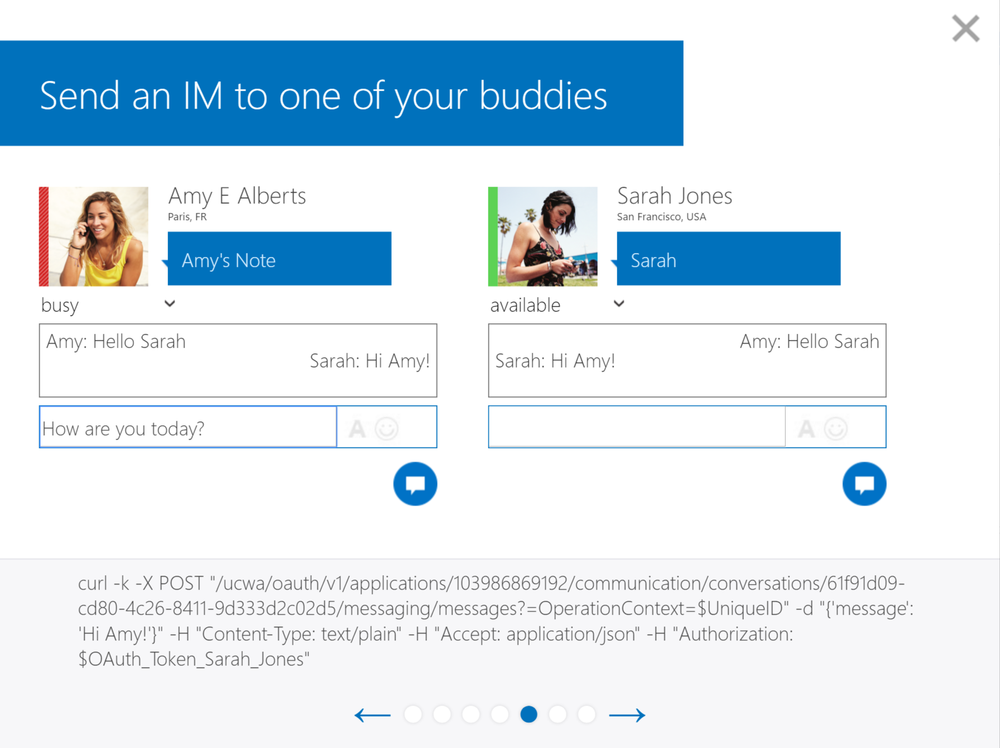

# Skype API (Quick) Notes
*Last modified*: 01 April 2016

### Unified Communications Web API (UCWA) 
https://ucwa.skype.com/about-ucwa  
_Microsoft’s Unified Communications Web API (UCWA) is the Next Generation Platform for Mobile and Web Development. As such, we have created this website to service mobile and web developers. Our goal is to help you get familiar with Skype for Business’s latest API as you embark in the journey of embedding communications in any app!_   

GitHub Skype Web SDK  | https://msdn.microsoft.com/en-us/library/dn962133(v=office.16).aspx 
Interactive UCWA Demo | https://ucwa.skype.com/login/explore  
Interactive Web SDK | https://ucwa.skype.com/websdk#   
UCWA Core Features | https://msdn.microsoft.com/en-us/library/dn323629(v=office.16).aspx
  * Contacts and Groups Management
  * Conversation History and Auto-Accept
  * Two-party and multi-party IM
  * Schedule an online meeting
  * Join an online meeting
  * Contact card
  * Phone audio
  * Anonymous access

Developer Video Intro | https://channel9.msdn.com/posts/Lync-Developer-Roundtable-UCWA-Overview   
Developer Video Getting Started | https://channel9.msdn.com/posts/Lync-Developer-Roundtable-Getting-Started-with-UCWA

### Developing Web SDK applications for Skype for Business Online
https://msdn.microsoft.com/en-us/library/office/mt622687(v=office.16).aspx  

### Programming Tasks
https://msdn.microsoft.com/en-us/library/office/dn962160(v=office.16).aspx  

* Retrieve the API entry point and sign in a user
* [Show a person's information](https://github.com/OfficeDev/skype-docs/blob/master/ShowPersonInfo.md)
* Search for persons and distribution groups
* Get a person and listen for availability
* Start a conversation
* Send and receive text in a conversation
* Respond to a conversation invitation
* Add participants to a conversation
* Join an existing meeting
* Add or remove audio in a conversation
* Add or remove video in a conversation
* Join a meeting with video and display the video streams
* Join a meeting anonymously
* Manage persons and groups
* Manage devices
* Save and restore a snapshot of the Application state
* Switch between video streams across conversations
* Use the Skype Web Conversation Control in a webpage

# UCWA Tasks
### Contact Card
The formatting can be changed, but the [UCWA Demo](https://ucwa.skype.com/login/explore) shows presence controls as shown in the image below. The operations that can be performend are: **{ Get Presence, Set Presence, Reset Presence, Get Note, Set Note, Reset Note, Get Photo }**  

### Two Party and Multi-Party IM (sendMessage)
The example from the [UCWA Demo](https://ucwa.skype.com/login/explore) showing Two Party IM

